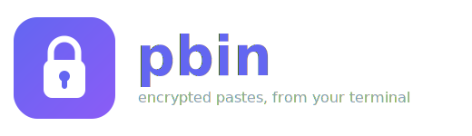

<p align="center">
  
</p>

<p align="center">
  <b>Terminalinizden uçtan uca şifreli <a href="https://privatebin.info">PrivateBin</a> paylaşımları oluşturun.</b>
</p>

<p align="center">
  <a href="README.md">English</a> · Türkçe
</p>

<p align="center">
  
</p>

`pbin`, PrivateBin için küçük ve zero-knowledge (sıfır bilgi) bir komut satırı
istemcisidir. Metniniz ağa çıkmadan önce **kendi makinenizde** AES-256-GCM ile
şifrelenir — sunucu yalnızca şifreli veriyi saklar ve çözme anahtarı sadece
paylaşım bağlantısının fragment kısmında yaşar. Tek, kendi kendine yeten bir
binary olarak gelir (PHP gömülüdür) ve herhangi bir PrivateBin instance'ıyla
çalışır.

---

## Özellikler

- 🔒 **Zero-knowledge** — istemci tarafında AES-256-GCM; anahtar sunucuya asla gönderilmez
- 🧩 **Her instance** — PrivateBin v2 API ile uyumlu (PrivateBin 1.3+)
- 🙈 **Gömülü sunucu yok** — ilk çalıştırmada kendi instance'ını gösterirsin
- 🎛️ **İnteraktif** — format (düz / Markdown / kaynak kod), son kullanma, şifre, okununca-sil veya açık tartışma
- 📋 **Pano** — paylaşım bağlantısı otomatik kopyalanır
- 📦 **Tek binary** — kurulacak bir şey yok; macOS (Apple Silicon & Intel), Linux (x86_64 & arm64), Windows

---

## Kurulum

**Homebrew (macOS / Linux):**

```bash
brew install ahmetbedir/tap/pbin
```

**Kurulum scripti (macOS / Linux):**

```bash
curl -fsSL https://github.com/ahmetbedir/pbin/releases/latest/download/install.sh | sh
```

**Windows (PowerShell):**

```powershell
irm https://github.com/ahmetbedir/pbin/releases/latest/download/install.ps1 | iex
```

Ayrıntılar, güncelleme ve kaynaktan derleme için [INSTALL.md](INSTALL.md).

---

## Hızlı başlangıç

```bash
pbin init      # PrivateBin host'unu bir kez ayarla (~/.pbin/config.json'a kaydedilir)
pbin create    # yaz, şifrele ve paylaşım bağlantısını al
```

`pbin init` host'u sorar ya da doğrudan verirsin:

```bash
pbin init --privatebin-host=https://privatebin.example.com
```

---

## Kullanım

`pbin create` seni şu adımlardan geçirir:

1. **İçerik** — çok satırlı editör (gönderilmeden önce yerelde şifrelenir)
2. **Format** — Düz Yazı, Markdown veya Kaynak Kod
3. **Son kullanma** — 5 dakika … 1 hafta ya da asla
4. **Şifre** — opsiyonel; anahtar türetmesini güçlendirir
5. **Tip** — okununca-sil, açık tartışma (yorumlar) veya hiçbiri

Bitince görüntüleme bağlantısı ekrana yazılır ve panoya kopyalanır.

---

## Yapılandırma

Tek ayar PrivateBin host'un; kullanıcıya özel olarak `~/.pbin/config.json`
içinde saklanır — asla kodda veya binary'de değil.

| Nasıl | Komut |
| --- | --- |
| İnteraktif | `pbin init` |
| Doğrudan | `pbin init --privatebin-host=https://…` |
| Env override (CI) | `PRIVATEBIN_URL=https://… pbin create` |

---

## Nasıl çalışır

`pbin`, PrivateBin'in kendi tarayıcı istemcisini birebir taklit eder; böylece
paylaşımlar herhangi bir tarayıcıda normal şekilde açılıp çözülür:

1. Rastgele 256-bit'lik bir anahtar yerelde üretilir ve **makineni asla terk etmez**.
2. `PBKDF2-SHA256` (100k iterasyon), bu anahtar + opsiyonel şifre + rastgele bir
   salt'tan AES anahtarını türetir.
3. Paylaşım JSON'a sarılır, DEFLATE ile sıkıştırılır, ardından **AES-256-GCM**
   ile şifrelenir; sunucuya yalnızca şifreli veri ve meta gider.
4. Anahtar base58 ile kodlanır ve URL'in **fragment** kısmına (`#…`) konur;
   tarayıcılar bunu sunucuya asla göndermez.

PrivateBin instance URL'i bilinçli olarak derlenmez — kullanıcıya özel ayarlanır,
böylece araç özel/iç instance'larla güvenle kullanılabilir.

---

## Kaynaktan derleme

PHP 8.2+ ve Composer gerekir.

```bash
composer install
php pbin create          # doğrudan kaynaktan çalıştır
php pbin app:build pbin  # PHAR üret
```

Çok platformlu binary'ler [phpacker](https://github.com/phpacker/phpacker) ile
üretilir ve `release.sh` ile yayınlanır — bkz. [INSTALL.md](INSTALL.md).

---

## Lisans

[MIT](LICENSE)
